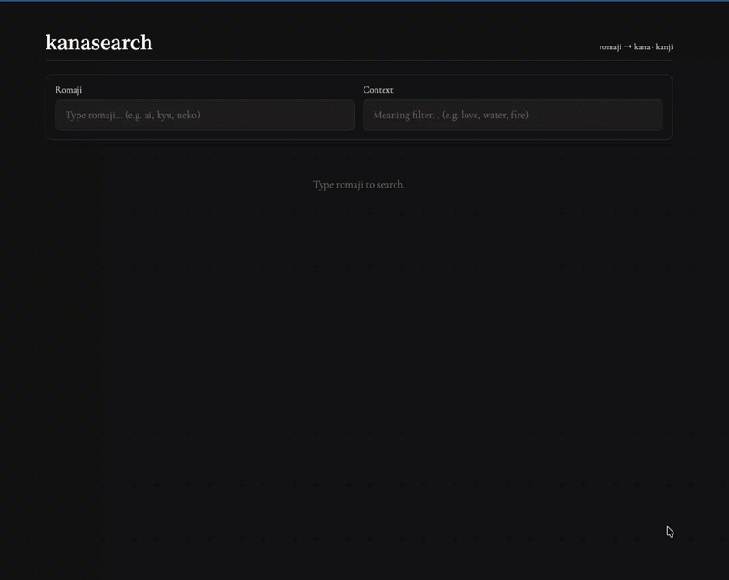

# kanasearch

Romaji to hiragana, katakana, and kanji search with fuzzy matching and context-based ranking. Dictionary data bundled from JMdict and KANJIDIC.



## Install

```
npm install kanasearch
```

## Usage

```js
import { search } from "kanasearch";

const results = search("ai", { context: "love", limit: 5, fuzzy: true });
```

## API

### `search(query, options?)`

Returns an array of `SearchResult` sorted by relevance score.

```ts
function search(query: string, options?: SearchOptions): SearchResult[];
```

#### `SearchOptions`

| Option    | Type      | Default | Description                                                  |
| --------- | --------- | ------- | ------------------------------------------------------------ |
| `limit`   | `number`  | `20`    | Max results to return                                        |
| `fuzzy`   | `boolean` | `true`  | Enable fuzzy matching (tolerates typos)                      |
| `context` | `string`  | —       | English meaning to rank kanji by (e.g. `"love"`, `"water"`) |

#### `SearchResult`

```ts
interface SearchResult {
  romaji: string;
  hiragana: string | null;   // e.g. "きゅ" — null for compound readings
  katakana: string | null;   // e.g. "キュ" — null for compound readings
  kanji: KanjiResult[];
  score: number;             // 1.0 = exact, 0.9 = prefix, <0.9 = fuzzy
}

interface KanjiResult {
  char: string;              // e.g. "愛"
  meaning: string[];         // e.g. ["love", "affection", "favourite"]
}
```

## Examples

### Basic search

```js
search("ai", { limit: 2 });
```

```json
[
  {
    "romaji": "ai",
    "hiragana": null,
    "katakana": null,
    "kanji": [
      { "char": "娃", "meaning": ["beautiful"] },
      { "char": "哀", "meaning": ["pathetic", "grief", "sorrow", "pathos", "pity", "sympathize"] },
      { "char": "愛", "meaning": ["love", "affection", "favourite"] },
      { "char": "挨", "meaning": ["approach", "draw near", "push open"] }
    ],
    "score": 1
  },
  {
    "romaji": "aida",
    "kanji": [{ "char": "間", "meaning": ["interval", "space"] }],
    "score": 0.9
  }
]
```

### Kana combo

Single-kana entries return `hiragana` and `katakana`:

```js
search("kyu", { limit: 1 });
```

```json
[{ "romaji": "kyu", "hiragana": "きゅ", "katakana": "キュ", "kanji": [], "score": 1 }]
```

### Fuzzy search

Tolerates typos — `"nko"` finds `"ko"`, `"boko"`, `"deko"`:

```js
search("nko", { limit: 3, fuzzy: true });
```

```json
[
  { "romaji": "akou", "kanji": [{ "char": "榕", "meaning": ["evergreen mulberry"] }], "score": 0.5 },
  { "romaji": "boko", "kanji": [{ "char": "凹", "meaning": ["concave", "hollow", "sunken"] }], "score": 0.5 },
  { "romaji": "deko", "kanji": [{ "char": "凸", "meaning": ["convex", "beetle brow", "uneven"] }], "score": 0.5 }
]
```

### Context-based ranking

Pass `context` to rerank kanji by meaning relevance. Without context, 愛 (love) appears third. With `context: "love"`, it's promoted to first:

```js
search("ai", { context: "love", limit: 1 })[0].kanji.slice(0, 3);
```

```json
[
  { "char": "愛", "meaning": ["love", "affection", "favourite"] },
  { "char": "娃", "meaning": ["beautiful"] },
  { "char": "哀", "meaning": ["pathetic", "grief", "sorrow", "pathos", "pity", "sympathize"] }
]
```

## Data

Dictionary data from the [Electronic Dictionary Research and Development Group](http://www.edrdg.org/):

- **JMdict** — Japanese-Multilingual Dictionary
- **KANJIDIC** — Kanji Dictionary

Used in accordance with EDRDG licence provisions.

## License

MIT
